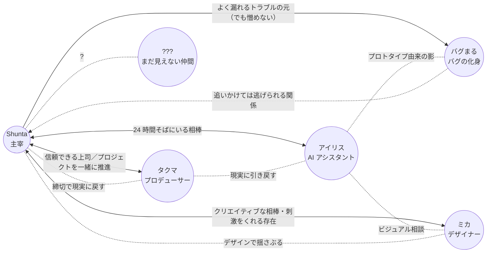

# 人間関係マップ

主人公 **Shunta** を中心とした、登場人物の関係性。
各キャラがどういう経緯でデジラボに参画したかは [`./origin.md`](./origin.md) を参照。

## 関係性の言語化

### 人間メンバー

#### Shunta ↔ ミカ（デザイナー）

- **クリエイティブな相棒であり良きライバル**
- ビジュアル面で刺激をくれる存在
- 「もっとこうしたら？」が口ぐせ
- ぶつかる軸: **勢い vs 完成度**。Shunta が「とりあえず出す」、ミカが「いやそれはダサい」
- 仲が悪いわけではなく、お互いに信頼している前提でぶつかる

#### Shunta ↔ タクマ（プロデューサー）

- 信頼できる上司
- プロジェクトを一緒に推進する相棒
- 締切最優先、細かい作業はデキる人に任せるタイプ
- ラボの "外と繋がる窓口" でもある
- ぶつかる軸: **作りたい vs 出すべき**。Shunta の暴走をタクマが現実に戻す

#### ミカ ↔ タクマ

- お互いに少し遠慮しながらも信頼している距離感
- ミカは "現場のテンション"、タクマは "外のテンション" を持ち寄る
- 二人で雑談しているとラボのトーンが整いやすい

### AI

#### Shunta ↔ アイリス（AI アシスタント）

- **24 時間そばにいる相棒**
- 雑談相手・調べ物・ツッコミ役
- たまに真顔で軽くボケて、Shunta が突っ込む構図にもなる
- ベンダーやモデルを特定しない **抽象的な AI の存在** として置いている
- ぶつかる軸: ほぼない。違和感があれば Shunta が立ち止まる

#### アイリス ↔ ミカ

- ビジュアルや配色のたたき台をミカがアイリスに投げる関係
- アイリスは数案を出してミカが選ぶ、というやり取りが定型化している

#### アイリス ↔ タクマ

- タクマは "現実" や "コスト" の視点をアイリスにぶつける
- アイリスの提案が暴走気味のときに、タクマが穏やかに引き戻す

### バグまる

#### Shunta ↔ バグまる（バグの化身）

- 倒しても倒しても出てくる **永遠のライバル兼マスコット**
- 追いかけては逃げられる関係
- S4 で **共存** を選ぶことになる
- 由来は仮説段階（[`./origin.md`](./origin.md) / [`./storyline/arcs/bugmaru.md`](./storyline/arcs/bugmaru.md)）

#### バグまる ↔ アイリス

- アイリスのカメラには **なぜか映らない**
- アイリスの初期プロトタイプ由来ではないか、という仮説の中心関係
- S2 終盤からバグまるがアイリスをかばう仕草を見せ始める
- アイリス側は "気配は感じる" と言うが、見えない

#### バグまる ↔ ミカ / タクマ

- ミカは "なんか可愛い" 派。デザインモチーフとして気に入っている
- タクマは "それで本番落ちるのは困る" 派。だが現場では憎んでいない

### ???（まだ見えない仲間）

- 連載が育つほど、ここに新しい顔が入る
- S3 終盤〜 S4 で **サポート / コミュニティ寄りの新メンバー候補** が登場予定
- それ以降の枠は完全に空けてある（新しい AI / 外部パートナー / インターン / 取材ライター…）

---

各キャラの詳細プロフィールは [`./characters/`](./characters/) を参照。
シリーズ全体の大外プロットは [`./storyline/`](./storyline/) を参照。
