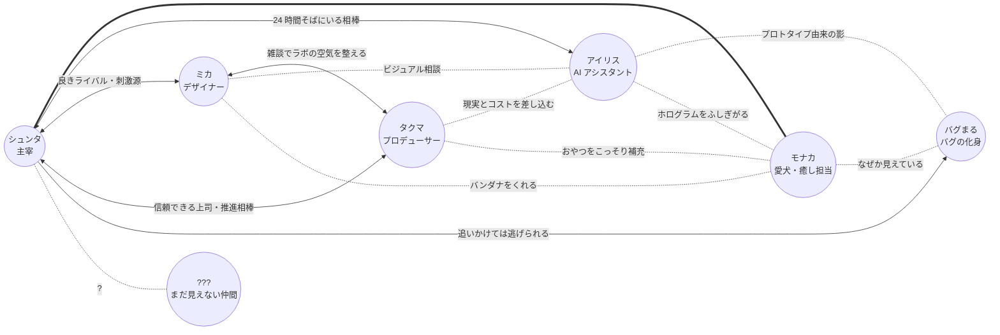

# 人間関係マップ

主人公 **シュンタ** を中心とした、デジラボ登場人物どうしの関係性。
各キャラがどういう経緯でデジラボに参画したかは [`./origin.md`](./origin.md) を参照。

> このページの目的は、**「迷ったときに引ける関係性の辞書」** を作ること。
> 一対一の関係だけでなく、**三人組・四人組で誰が誰を止めるか** までを言語化しておく。
> ネタを書くときの "型" が増える。

---

## 全体図

凡例:
- 太線 (`===`): 家族レベルの強い結びつき
- 双方向 (`<-->`): 対等で活発なやり取り
- 点線 (`.-`): 静かな距離感 / 副次的な関係

---

## 1. 二者関係（一対一の言語化）

### シュンタ ↔ ミカ（デザイナー）

- **クリエイティブな相棒であり良きライバル**
- ビジュアル面で刺激をくれる存在
- 「もっとこうしたら？」が口ぐせ
- ぶつかる軸: **勢い vs 完成度**。シュンタが「とりあえず出す」、ミカが「いやそれはダサい」
- 仲が悪いわけではなく、お互いに信頼している前提でぶつかる

### シュンタ ↔ タクマ（プロデューサー）

- **信頼できる先輩・推進パートナー**
- 締切最優先、細かい作業はデキる人に任せるタイプ
- ラボの "外と繋がる窓口" でもある
- ぶつかる軸: **作りたい vs 出すべき**。シュンタの暴走をタクマが現実に戻す

### シュンタ ↔ アイリス（AI アシスタント）

- **24 時間そばにいる相棒**
- 雑談相手・調べ物・ツッコミ役
- たまに真顔で軽くボケて、シュンタが突っ込む構図にもなる
- ベンダーやモデルを特定しない **抽象的な AI の存在** として置いている
- ぶつかる軸: ほぼない。違和感があれば シュンタが立ち止まる

### シュンタ ↔ バグまる（バグの化身）

- 倒しても倒しても出てくる **永遠のライバル兼マスコット**
- 追いかけては逃げられる関係
- S4 で **共存** を選ぶことになる
- 由来は仮説段階（[`./origin.md`](./origin.md) / [`./storyline/arcs/bugmaru.md`](./storyline/arcs/bugmaru.md)）

### シュンタ ↔ モナカ（愛犬）

- **家族**。ラボの全員より付き合いが長い
- 設立前夜、シュンタが疲弊していた時期に **生活リズム** を支えてくれた存在
- 「日々の手応え」を大事にするデジラボの姿勢の **原型**
- ぶつかる軸: ない。ただし朝の散歩を忘れた日は **無言で玄関に座る** プレッシャーがある
- 落ち込んだ日に最初に気づくのはアイリスではなく **モナカ**

### ミカ ↔ タクマ

- **遠慮しながらも信頼している距離感**
- ミカは "現場のテンション"、タクマは "外のテンション" を持ち寄る
- 二人で雑談しているとラボのトーンが整いやすい
- ぶつかる軸: **直感 vs 段取り**。ただし相手の領分を尊重するため、表立ってはぶつからない
- ミカのカラー選定にタクマが「見やすさは？」とだけ聞く、のような小さな摩擦が定型

### ミカ ↔ アイリス

- ビジュアルや配色のたたき台をミカがアイリスに投げる関係
- アイリスは数案を出してミカが選ぶ、というやり取りが定型化している
- ミカは「最終決定は私が出す」を曲げない
- アイリスもそれを尊重しているので、ぶつかることはない

### タクマ ↔ アイリス

- タクマは **"現実" や "コスト" の視点** をアイリスにぶつける
- アイリスの提案が暴走気味のときに、タクマが穏やかに引き戻す
- アイリスはタクマに対してだけ **微妙に丁寧度が高い**（半冗談）

### アイリス ↔ バグまる

- アイリスのカメラには **なぜか映らない**
- アイリスの初期プロトタイプ由来ではないか、という仮説の中心関係
- S2 終盤からバグまるがアイリスをかばう仕草を見せ始める
- アイリス側は "気配は感じる" と言うが、見えない

### ミカ / タクマ ↔ バグまる

- ミカは "なんか可愛い" 派。デザインモチーフとして気に入っている
- タクマは "それで本番落ちるのは困る" 派。だが現場では憎んでいない
- ふたりとも **本気で倒そうとはしていない**

### モナカ ↔ アイリス

- ホログラムが点くと **不思議そうに見上げる**。たまにしっぽは振る
- アイリスはモナカに向けて声色がほんの少し柔らかくなる（描写は控えめに）
- 二者の組み合わせは "癒し増幅装置"。煮詰まり回の最終手段に使える

### モナカ ↔ ミカ

- ミカは **モナカ用バンダナ** を何枚も作っている（ファッションデザイナー的こだわり）
- モナカは気に入らないバンダナを **口で外して床に落とす**（ミカの心が折れる）
- モナカのために観葉植物の配置を変えるくらいには本気

### モナカ ↔ タクマ

- 表向きは "犬は集中の敵" と言っていたが、3 日で陥落
- 実は一番遊んでいる。誰も見ていない時にだけ、こっそり遊ぶ
- **おやつ缶を補充する係** は黙ってタクマがやっている

### モナカ ↔ バグまる ⭐（重要）

- モナカは **バグまるが見えている数少ない（おそらく唯一の）存在**
- 吠えない / 警戒しない / 追いかけない。ただ **じっと見る**
- バグまると並んで寝ている回 (`arc: bugmaru`) は、伏線回として強い
- シュンタは「モナカ、何見てるの？」と聞くが、モナカは答えない（当然）
- **作中ではこの関係を明言しない**。読者が "もしかして" と気づく余白として残す
- → 詳細は [`./storyline/arcs/bugmaru.md`](./storyline/arcs/bugmaru.md)

### ??? ↔ シュンタ（まだ見えない仲間）

- 連載が育つほど、ここに新しい顔が入る
- S3 終盤〜 S4 で **サポート / コミュニティ寄りの新メンバー候補** が登場予定
- それ以降の枠は完全に空けてある（新しい AI / 外部パートナー / インターン / 取材ライター…）

---

## 2. 対立軸の整理（笑いの "型" の起点）

迷ったらこの表からネタを引ける。"対立" といってもケンカではなく、
**役割の違いから生まれる定型のすれ違い**。

| ペア                  | 対立の軸                  | こうなりやすい瞬間                                    |
| --------------------- | ------------------------- | ----------------------------------------------------- |
| シュンタ ↔ ミカ       | 勢い vs 完成度            | 「とりあえず出す」「いやそれダサい」                  |
| シュンタ ↔ タクマ     | 作りたい vs 出すべき      | 「次これ作りたい」「リリース日は？」                  |
| シュンタ ↔ アイリス   | 直感 vs 提案 (穏やか)     | 「これ行ける？」「3 案ご提案します」                  |
| シュンタ ↔ バグまる   | 倒したい vs 逃げる        | 追いかける → 指の届かない位置に逃げる                 |
| シュンタ ↔ モナカ     | 仕事 vs 散歩              | 「もう少しで終わる」「（玄関に無言で座る）」          |
| ミカ ↔ タクマ         | 直感 vs 段取り            | カラー選定に「見やすさは？」とだけ聞かれる            |
| ミカ ↔ アイリス       | 即決 vs 数案提案          | 「3 案出します」「最初の 1 個でいい」                 |
| タクマ ↔ アイリス     | 現実コスト vs 理想提案    | 「コストは？」「……再提案します」                     |
| ミカ ↔ バグまる       | 可愛い vs バグ            | 「グッズにしたい」「いや本番で増えてる」              |
| タクマ ↔ バグまる     | 障害源 vs 共存案          | アラートが鳴った瞬間の真顔                            |

> **ぶつかっているように見えて、誰も人格否定はしない**。
> ラボの基準温度はあくまで **前向き** であることを忘れない。

---

## 3. 三者・四者ダイナミクス（誰が誰を止めるか）

煮詰まったときの **"場の動かし方"** をパターン化しておく。
書き手が詰まったら、この型のどれかにキャラを流し込めばオチが立つ。

### A. シュンタ vs ミカ（勢い vs 完成度）

- **裁定者**: タクマが「で、いつ出すの？」と一言で締める
- **空気変換**: モナカがソファに転がってお腹を見せる → 二人とも撫でに行く
- **逃げ道**: アイリスが「両案ご提案します」で 3 案を出して時間を稼ぐ

### B. シュンタ + アイリス の暴走（"これ面白い！" 機関車）

- **ブレーキ役**: タクマがコーヒーを片手に「で、コストは？」
- **デザイン側修正**: ミカが「もっとシンプルにしよ？」
- **物理ブレーキ**: モナカがキーボードに座る

### C. タクマ vs シュンタ（締切 vs 創作）

- **緩衝材**: ミカが「両方やればよくない？」と乱暴な提案
- **沈黙係**: アイリスが何も言わずに進行表をモニターに出す
- **モナカの仲裁**: 二人の間に座って交互に見る（仲裁ではなく、たまたま日向）

### D. 全員が煮詰まる（リリース前夜・障害対応）

- **救世主**: モナカが伸びをして散歩を要求 → 全員強制リフレッシュ
- **救世主 (室内)**: アイリスが過去ログから "3 ヶ月前の自分たち" を引用
- **救世主 (人)**: タクマがコーヒーを淹れ直す（一番強い）

### E. バグまるが現れた（"デバッグ地獄回"）

- **追跡役**: シュンタ（指の届かない位置に逃げられる）
- **観察役**: アイリス（カメラには映らないことを再確認）
- **デザイン役**: ミカ（いつの間にかスケッチしている）
- **回避役**: タクマ（「本番落とすな」だけ言って次の話題に）
- **唯一の目撃者**: モナカ（無言で同じ方向を見ている、伏線）

### F. 新メンバーが来る（S3 終盤〜 S4）

- **オンボード担当**: ミカ（ラボのトーンを言語化する）
- **段取り**: タクマ（外向けの体裁を整える）
- **空気作り**: シュンタ（雑談から始める）
- **最大の関門**: モナカ（懐けば全員から信頼される）

---

## 4. 早見表: 各キャラ ↔ AI / バグまる / モナカ

ラボには "人間外" の 3 つの存在（アイリス / バグまる / モナカ）がある。
それぞれと、各キャラがどう接しているかの早見表。

| キャラ   | アイリス との距離                     | バグまる との距離                | モナカ との距離                          |
| -------- | ------------------------------------- | -------------------------------- | ---------------------------------------- |
| シュンタ | 24 時間そばにいる相棒                 | 追いかけては逃げられる / S4 共存 | 家族。ラボの誰よりも付き合いが長い        |
| アイリス | 自身                                  | 見えない / "気配は感じる"        | ホログラムを不思議そうに見上げてくる存在 |
| ミカ     | ビジュアル相談 / 数案出してもらう     | "なんか可愛い" / モチーフ化     | バンダナを贈る相手 (たまに却下される)     |
| タクマ   | "現実" を差し込む / 微妙に丁寧度高め  | "本番落とすな" / でも憎まない    | おやつ缶補充係 (こっそり)                 |
| バグまる | プロトタイプ由来の影 (仮説)           | 自身                             | **見られている** (作中では明言しない)     |
| モナカ   | しっぽを振る / ふしぎがる              | **見えている / 並んで寝る**       | 自身                                     |

---

## 5. 関係の S1 → S4 遷移

シーズンを通して関係性は少しずつ変化する。**完成形にはしない**。

| ペア                | S1                                | S2                                          | S3                                            | S4                                                |
| ------------------- | --------------------------------- | ------------------------------------------- | --------------------------------------------- | ------------------------------------------------- |
| シュンタ ↔ ミカ     | "勢い vs ダサい" の定型            | "外向けの顔" を巡って熱くなる                | "ブランド" を語れる関係に                      | "ラボの第二章" を一緒に設計する                    |
| シュンタ ↔ タクマ   | 締切で現実に戻される               | リリース判断を任せ始める                     | 新メンバー受け入れを共に決める                 | "次に何を出すか" を二人で語り合う                  |
| シュンタ ↔ アイリス | 雑談相棒                           | プロダクト化に二人で揺れる                   | "彼（バグまる）と話そうか" を相談される        | v1/v2 を並走させる選択を一緒にする                |
| シュンタ ↔ バグまる | 追う側 / 逃げる側                  | 親密の予感                                   | 仮の真相に気づく                              | **共存を選ぶ**                                     |
| シュンタ ↔ モナカ   | 朝の散歩で 1 日が始まる             | プロダクト化で疲れた日にソファで添い寝       | 障害対応の徹夜中、足元で寝てくれている         | 引っ越しに困惑するが、新オフィスでも定位置を作る   |
| ミカ ↔ タクマ       | 雑談でトーンを整える                | β 版の見せ方で初めて本格的に組む             | 新メンバーオンボードで連携                     | 新オフィス内装と外向け説明で並走                  |
| アイリス ↔ バグまる | 不可解ログの伏線                   | かばう仕草                                   | 仮の真相に近づく                              | 共存。だが新たな謎で関係が再定義される             |
| モナカ ↔ バグまる   | 一瞬同じ方向を見る (1 回だけ)      | 同じ画面で寝ている回 (1 回)                 | バグまるが助けに来た回、モナカも一緒にいる     | "並んでいる絵" が共存の象徴になる                  |
| 新メンバー ↔ 全員   | (まだ存在しない)                   | (まだ存在しない)                            | 部外者として登場 / 居場所を見つけ始める        | 正式参画。モナカに懐かれて全員から信頼される      |

> **モナカは "成長" させない**。常に "今日のモナカ" を描く。
> 関係性の S1 → S4 変化は、**周りがモナカをどう扱うか** で表現する。

---

## 6. ??? まだ見えない仲間

- 連載が育つほど、ここに新しい顔が入る
- S3 終盤〜 S4 で **サポート / コミュニティ寄りの新メンバー候補** が登場予定
- それ以降の枠は完全に空けてある（新しい AI / 外部パートナー / インターン / 取材ライター…）
- 新メンバーの **モナカへの態度** を、その人物の "ラボ適合度" を読者に示すサインとして使う

---

## 関連ドキュメント

- 各キャラの詳細プロフィール: [`./characters/`](./characters/)
- 起源・参画ストーリー: [`./origin.md`](./origin.md)
- 年表: [`./timeline.md`](./timeline.md)
- 大外プロット: [`./storyline/`](./storyline/)
- バグまるアーク: [`./storyline/arcs/bugmaru.md`](./storyline/arcs/bugmaru.md)
