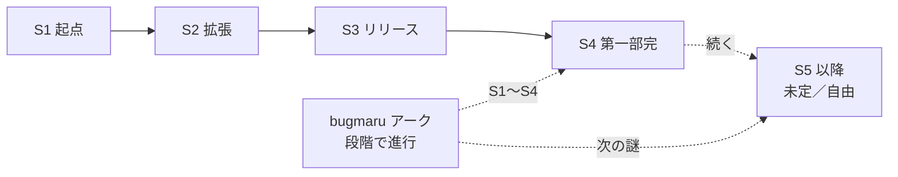

# 大外ストーリーライン (Overarching Plot)

> 1 話（画像 1 枚）は「単発で笑える」ことが最優先。背後に長期構造を
> 仕込んでおくと、続けて読む読者だけが拾える "もうひとつの楽しみ" が生まれる。
>
> このシリーズは **長期連載を前提** に設計する。
> 大方針は **「シーズン = 区切り」「全体 = 終わらせない」**。

## 0. 基本方針

- **終わらせないことを最優先**にする。"ゴール" や "最終話" を最初から決めない
- シーズンは "区切り" であって "完結" ではない。第一部完 → 第二部 → ...と
  いくらでも続けられる構造にしておく
- **ペースは固定しない**。毎日連載ではなく、ネタが揃ったら出す（詳細は
  [`../../meta/workflow.md`](../../meta/workflow.md) を参照）
- バグまる伏線は「回収」ではなく **「謎が深まる／分岐する」** 設計にする
  → 仮の真相に近づいたあと、必ず新しい謎を生やせるようにしておく
- 新キャラ・新拠点・新プロダクト・季節回 / 年中行事回 / 番外編 を、
  いつでも増やせる余白を残す
- **1 話 = 画像 1 枚** で必ずオチる。連作でも各話単独で読める

## 1. シーズン構造（A 軸）

シーズンごとにデジラボとして取り組む "大プロジェクト" を設定する。
日常回（1 話 = 画像 1 枚）は、そのプロジェクトの中の **1 場面の切り取り** として描く。

| シーズン | 仮タイトル                     | 主プロジェクト                                       | テーマ                                       |
| -------- | ------------------------------ | ---------------------------------------------------- | -------------------------------------------- |
| **S1**   | デジラボ、はじめる             | デジラボ公式サイト + ポートフォリオ                  | キャラ紹介・日常確立・シリーズの基盤         |
| **S2**   | AI と作る、AI と笑う           | アイリスを社内 AI から世の中向けプロダクト化         | AI ものづくりのリアル・運用・倫理            |
| **S3**   | リリースの先に                 | 大型リリース + 社外イベント + ユーザー対応           | "作る" から "届ける" へ。チーム拡張          |
| **S4**   | 第一部完: 共存のはじまり        | プロダクトの世代交代 + 新オフィス                    | バグまるとの関係に一区切り。だが終わらない   |

各シーズンの詳細プロットは [`./seasons/`](./seasons/) を参照。

> シーズンの長さは **話数ではなくテーマ** で区切る。
> 想定したテーマ・出来事を一通り描き終えたら次シーズンへ移る、ぐらいの粒度で考える。

> S4 は **"最終章" ではない**。バグまるとの関係に節目を作るが、必ず新しい
> 謎を残す。S5 以降の構想は **あえて書かない** ことで自由を確保する。

## 2. 縦軸の長期伏線（B 軸）

シーズン構造とは別に、シリーズ全体を貫く長期伏線を **アーク** として持つ。

| アーク       | 内容                                       | 詳細                                  |
| ------------ | ------------------------------------------ | ------------------------------------- |
| `bugmaru`    | バグまる "謎が深まる" 設計                  | [`./arcs/bugmaru.md`](./arcs/bugmaru.md) |

> 倒すゴールも、解明するゴールも置かない。**「層が増える」** ように
> 伏線を配ることで、長期連載を支える縦糸とする。

## 3. ネタの "層"

連載を支える、エピソードの種類別の比率目安。

| arc          | 役割                       | 目安比率 |
| ------------ | -------------------------- | -------- |
| `standalone` | 単発の日常回               | **約 7 割（主食）** |
| `main`       | シーズン主筋に絡む話       | 1.5 割   |
| `bugmaru`    | バグまる伏線回             | 0.5 割（控えめ） |
| `seasonal`   | 季節 / 年中行事回           | 1 割    |
| `side`       | 番外編・スピンオフ・過去回 | 0〜1 割（必要に応じて） |

`standalone` を 7 割以上に保つことで、**いつでも誰でも入れる連載** にする。

## 4. 拡張の余白

長期連載は新陳代謝が必要。意図的に "後で追加できる枠" を残す。

- **新キャラ枠**: インターン / 新人 / 外部パートナー / 競合エンジニア /
  取引先デザイナー / カフェ店主 / SRE 担当 / 監査役 など
- **新拠点枠**: サテライトオフィス、出張先、海外支社、ワーケーション先、
  自宅、共用カフェ
- **新プロダクト枠**: アイリスの兄弟 AI、別チームのプロダクト、副業プロジェクト
- **ライバル枠**: 別会社のエンジニア、兄弟プロダクト、"別系統のバグまる" を
  扱う組織
- **時間枠**: 過去回・未来回（「10 年後のデジラボ」など）も解禁

## 5. シーズン末の小ピーク

「終わらせない」とはいえメリハリは必要。各シーズンの終盤には小ピークを置く。

- シーズン主プロジェクトの山場（リリース・登壇・受賞など）
- バグまるアークの "段が一つ進む" 回
- 翌シーズンへのフックとなる **小さな謎を 1 つだけ** 提示

## 6. 物語ロジック（イメージ）



## 7. 運用ルール

### エピソードの位置付けタグ

front matter に必ず入れる:

```yaml
season: S1                # S1 〜 S4（S5+ 以降は決まり次第）
arc: standalone           # standalone | main | bugmaru | seasonal | side
```

### Milestone

GitHub の Milestone をシーズンに対応させる:

- `Season 1 — デジラボ、はじめる`
- `Season 2 — AI と作る、AI と笑う`
- `Season 3 — リリースの先に`
- `Season 4 — 第一部完: 共存のはじまり`

各シーズン末に [`./seasons/`](./seasons/) のシーズンファイルに振り返りを追記する。

### "いつでもやめさせない" 設計

- 企画書に **「最終回」「完結」「ラスボス」を書かない**
- バグまるの真相は **書き手も完全には決めない**。仮説を増やしながら走る
- ネタが詰まったら、`arc: side`（スピンオフ・過去回・夢オチ）を増やす
- `../../ideas/` に **常時ストックを残す**（量より、いつでも次に進める状態を維持する）
- 季節回・年中行事回は再利用可（毎年新ネタにできる）
- ペース固定なし。出せる時に出す（詳細は
  [`../../meta/workflow.md`](../../meta/workflow.md)）

---

## 関連ドキュメント

- [世界観](../world.md)
- [起源・参画ストーリー](../origin.md)
- [年表](../timeline.md)
- [人間関係マップ](../relationships.md)
- [シーズン詳細](./seasons/)
- [長期アーク](./arcs/)
- [ワークフロー](../../meta/workflow.md)
