# 年表 (Timeline)

> "いつ・何が起きたか" を緩く揃えるためのメモ。
> 連載中に毎回参照する必要はないが、書き手が迷ったときの拠り所として残す。
> 具体的な西暦は **書かない**（時代をぼかしておくため）。
> 代わりに **Y-N / Y0 / Y+N** という相対表記を使う。

## 表記ルール

- `Y0`: デジラボ設立の年
- `Y-N`: 設立 N 年前
- `Y+N`: 設立 N 年後
- `S1〜S4`: 連載のシーズン
- 月単位の精度はあえて持たない（季節は描き手の都合で動かせるように）

## 年表本体

### 設立前夜 (`Y-N`)

| 時期       | 出来事                                                                          |
| ---------- | ------------------------------------------------------------------------------- |
| `Y-数年`    | Shunta、ある程度大きなチームに在籍。やりがいはあるが "段取り疲れ" を感じ始める |
| `Y-1` 前後 | Shunta が副業案件をいくつか回す中で **ミカ** と知り合う                         |
| `Y-1` 前後 | Shunta、前職の先輩 **タクマ** と継続的に飲み仲間として近い距離感を保つ           |

### 設立 (`Y0`)

| 時期       | 出来事                                                                |
| ---------- | --------------------------------------------------------------------- |
| `Y0` 春     | Shunta、週末プロジェクトの延長として **デジラボ設立**。一人で開始    |
| `Y0` 夏     | "話しかけられる相棒が欲しい" と感じ、抽象 AI **アイリス** を常駐させる |
| `Y0` 秋     | ミカ、休日に何度か顔を出すうちに **デザイン担当として参画**          |
| `Y0` 冬     | タクマ、"出さないと意味ない" と言いに来てそのまま **居着く**          |

> アイリスは "ある日突然導入された" のではなく、**Shunta が試行錯誤しながら
> 自分の作業環境に常駐させていったもの** として描く。

### 連載開始前 (`Y+1` 前後)

| 時期       | 出来事                                                                     |
| ---------- | -------------------------------------------------------------------------- |
| `Y+1` 春   | デジラボの 4 人 + 1 体体制が安定する                                        |
| `Y+1` 春   | Shunta が「ものづくりの裏側を漫画で残してみよう」と決める → **連載開始**   |

### Season 1 (`Y+1`)

| 時期           | 出来事                                                                 |
| -------------- | ---------------------------------------------------------------------- |
| S1 序盤        | メンバーの紹介回が順番に出る                                            |
| S1 中盤        | デジラボサイト着手・デザインバトル / **バグまる初登場（萌芽 → 接触）**  |
| S1 終盤        | サイト公開 / **アイリスのログに不可解な記録**（S2 への引き）            |

### Season 2 (`Y+1` 〜 `Y+2`)

| 時期           | 出来事                                                                       |
| -------------- | ---------------------------------------------------------------------------- |
| S2 序盤        | アイリスのプロダクト化キックオフ / **バグまるアーク "違和感"**                |
| S2 中盤        | プロンプト沼・ハルシネーション・コスト・倫理ネタが続く                       |
| S2 終盤        | アイリス β リリース / **バグまるアーク "親密"**                              |

### Season 3 (`Y+2` 〜 `Y+3`)

| 時期           | 出来事                                                                       |
| -------------- | ---------------------------------------------------------------------------- |
| S3 序盤        | 本格リリース準備 / 障害対応 / 登壇                                           |
| S3 中盤        | コミュニティ運営 / 新メンバー候補登場 / **バグまるアーク "共闘"**             |
| S3 終盤        | アイリス本格リリース / **バグまるアーク "仮の真相"**                          |

### Season 4 (`Y+3` 〜 `Y+4`)

| 時期           | 出来事                                                                                |
| -------------- | ------------------------------------------------------------------------------------- |
| S4 序盤        | 新オフィス検討 / アイリス v2 構想 / 新メンバー正式参画                                |
| S4 中盤        | アイリス v1 と v2 の対話 / **バグまるアーク "共存"**                                   |
| S4 終盤        | 新オフィス引っ越し / アイリス v2 リリース / **別系統のバグまる観測（"新たな謎"）** / **第一部完** |

### Season 5+ (`Y+4` 以降)

> **あえて何も書かない**。連載中に必要になったタイミングで決める。
> "新しい謎" の正体・新メンバーの背景・アイリス v1/v2 の関係・新オフィスの隣人 などが燃料候補。

## キャラ別の入線タイミング

```mermaid
gantt
    title キャラ参画タイムライン（相対年）
    dateFormat  X
    axisFormat  Y%s

    section Shunta
    在籍 (主宰)             :0, 100
    section アイリス
    常駐 (抽象 AI)          :3, 100
    section ミカ
    参画 (デザイン)         :6, 100
    section タクマ
    参画 (プロデューサー)    :9, 100
    section バグまる
    出現 (S1 中盤〜)        :13, 100
    section 新メンバー
    候補 (S3 終盤〜) → 正式 (S4)  :16, 100
```

> Gantt の数字は厳密ではなく、相対的な順序を示すための目安。

## 運用ルール

- 新しい "出来事" を描いた / 描く予定が立ったら、ここに追記する
- 西暦は書かない（時代を固定しない）
- 季節 / 月の精度は **エピソード側で決める**（ここでは "S1 中盤" など粒度を粗く）
- シーズン振り返りのタイミングで [`./storyline/seasons/`](./storyline/seasons/) と
  突き合わせて整合を取る
