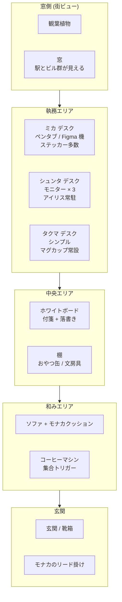

# 世界観・舞台設定

> ラボの設立経緯・メンバー参画ストーリーは [`./origin.md`](./origin.md) を、
> 年表は [`./timeline.md`](./timeline.md) を、用語集は [`./lexicon.md`](./lexicon.md) を参照。

## 🏢 デジラボ — 小さな未来の実験室

ソフトウェア開発、デザイン、アイデアが飛び交う、**少人数のクリエイティブスタジオ**。
最新のツールとコーヒーとユーモアで、今日も何かが生まれる場所。

### ミッション

> **コードとアイデアで、ワクワクを現実に変える。**

### バリュー（運営姿勢）

- **試してみよう** — 思い付きを動くものに変えるスピードを最優先
- **直感も尊重する** — ロジックだけでなく "面白そう" を判断材料にする
- **記録する** — やったこと・考えたことを Git に残し、後から拾えるようにする
- **AI を仲間として扱う** — ツールではなく、相棒として議論する

### キーワード

`#開発` `#デザイン` `#アイデア` `#日常コメディ` `#ものづくり`

### トーン

- 基本は **明るく前向きな日常コメディ**
- 技術ネタ・デザインネタを **小ネタ** として混ぜる
- 失敗もバグも、最後はクスッと笑える落ちに
- "AI 礼賛" にも "AI 不要論" にも振りすぎない

## 時間軸

- **現代 + ちょっと近未来**。数年後ぐらいの肌感
- AI が "同僚" として日常に溶け込んでいる程度のリアリティ
  - "便利な道具" ではなく、"いつも一緒に作業している誰か" として描く
  - ただし AI は物理的な作業はできない（ホログラム / モニター越しの存在）
- 1 話完結が基本。ときどき "前回の続き" もアリ
- 季節は実時間に合わせる（季節回・年中行事回を入れやすくするため）

## デジラボ本部（メイン舞台）

### 物理的な雰囲気

- 少人数（人間 3 名 + AI 1 体 + 犬 1 匹 + ?）でちょうど回るサイズ
- 24 時間ゆるく開いていて、誰か（or 何か）が何か作っている、もしくは寝ている
- ガラス越しに街が見える、駅近の小さなビルの一室
- 床は無垢材、壁は白、要所にネオンピンクのアクセント（ミカが整えた）
- ソファ脇に **モナカ専用クッション**、棚の隅に **おやつ缶**

### 物語の "場" として登場するもの

| 要素             | 役割                                                  |
| ---------------- | ----------------------------------------------------- |
| デジラボ本部     | メインの舞台。執務スペース＋ホワイトボード             |
| モニター 3 枚    | コード・デザイン・参考資料が常に映っている             |
| コーヒーマシン   | 集合場所。雑談 → ひらめきが生まれるトリガー            |
| 観葉植物         | 背景に必ずいる。なごみ係                               |
| ホワイトボード   | アイデア出し・タスク管理・落書きの兼用                 |
| 付箋・メモ       | バックログ、突然のひらめき                             |
| アイリスの定位置 | デスク中央のホログラム / モニター上のマスコット表示    |
| モナカの定位置   | ソファ / 日向 / ホワイトボード前。会議の "和み枠"      |
| おやつ缶         | 棚の隅。タクマがこっそり補充する                       |
| バグまる出現スポット | コードのコメント中、本番ログ、夜のモニターの隅       |

### 見取り図（ゾーン構成）

ラボは **1 室・1 フロア**。窓側 → 中央 → 玄関側 でゾーンが緩く分かれている。

#### ゾーンのキャラ密度

| ゾーン       | 主に居る存在                              | 1 話で使うフック                         |
| ------------ | ----------------------------------------- | ---------------------------------------- |
| 窓側         | 観葉植物 / 街の景色                       | 季節描写・空・夕暮れ・思考のフレーミング |
| 執務エリア   | シュンタ / ミカ / タクマ + アイリス        | 仕事・議論・ボケツッコミ                 |
| 中央エリア   | 全員（立ち話）+ ホワイトボード             | アイデア出し・付箋ネタ・落書きオチ       |
| 和みエリア   | モナカ / コーヒーマシン                    | 空気変換・雑談 → ひらめき・煮詰まり解除  |
| 玄関         | (出入りの瞬間)                            | 朝の "おはよう" / 夕方の "お疲れ"        |

> 1 話の中で **2 ゾーン以上を移動** すると、画面の温度が変わって読者が飽きにくい。
> 例: 執務エリアで議論 → 和みエリアでモナカに撫でながらオチ。

### ラボの 1 日（時間枠）

連載の "時間帯フック" を揃えるための枠組み。
1 話完結なので毎回使う必要はないが、**時間帯を立たせたい回** で迷ったらこの表を引く。

| 時刻        | 出来事                                                       | この時間が活きる回                       |
| ----------- | ------------------------------------------------------------ | ---------------------------------------- |
| 7:00        | シュンタ宅。**朝の散歩**（シュンタ + モナカ）                | 季節回・休日回・思考整理回               |
| 9:00        | シュンタとモナカが出勤                                        | 出社あるある・通勤あるある               |
| 9:30        | コーヒーマシン起動 → **アイリス起動** → メンバー集合の合図    | 「動いた」「動かない」系のあるある       |
| 10:00       | ミカ来る。雑談 → ホワイトボード前で朝の議題                  | デザインバトル / 雑談ひらめき            |
| 10:30       | タクマ来る。**進行確認**                                      | 締切リマインド回・現実に戻される回       |
| 12:00       | 昼 / **散歩タイム**（ミカ or シュンタがモナカ担当）            | 街シーン・季節回・煮詰まり解除回         |
| 13:00       | 集中タイム（無音）                                            | 没入回・徹夜の前ふり                     |
| 15:00       | 雑談 → **ひらめきタイム**                                     | コーヒーマシン前の議論 → アイデア回      |
| 17:00       | タクマがコーヒーを淹れ直す（一日の節目）                      | 今日の整理・明日の段取り回               |
| 19:00       | シュンタとモナカが帰宅                                        | "今日はここまで" 回 / 帰り道の独白       |
| 21:00 以降  | ラボは無人（**アイリスは常駐**、たまにバグまるが出る）        | 夜のモニターの隅・伏線回                 |

> **モナカの不在時間 (21:00〜翌 9:00)** が、ラボの "別の顔" を出すフレーム。
> バグまる伏線回はこの時間帯を使うと自然。

### 三種の神器とガジェット

ラボに必ずある "看板アイテム" を整理しておく。
1 話の中に **三種の神器のうち最低 1 つ** を入れると、画面が "デジラボらしく" なる。

#### 三種の神器（必須トリガー）

| 神器             | 役割                                                  |
| ---------------- | ----------------------------------------------------- |
| **コーヒーマシン** | **集合のトリガー**。音 → 人が集まる → 雑談が始まる    |
| **ホワイトボード** | **思考のキャンバス**。付箋 / 落書き / 議論の可視化     |
| **モナカのおやつ缶** | **リセットのトリガー**。煮詰まり → おやつ → 場が動く |

#### キャラ別の定番小道具

| キャラ   | 小道具                                                  |
| -------- | ------------------------------------------------------- |
| シュンタ | パーカー（フードを被ると思考モード）/ ノート PC を手で持つ |
| アイリス | ホログラム本体 / ディスプレイ表情 / "0.5 秒の沈黙"      |
| ミカ     | ベレー帽 / タブレット / ステッカー貼ったスマホケース    |
| タクマ   | コーヒーマグ / カレンダーアプリを開いた PC               |
| モナカ   | ミカ作のバンダナ（淡いネオンピンク）/ お気に入りクッション |
| バグまる | （無し）画面ノイズが効果音的小道具                       |

#### モジュラーなガジェット枠（増やしてよい）

連載が長くなったら追加できる "余白" として残す:

- **新しい AI デバイス**（S2 で増えるかも）
- **登壇用のスライドツール一式**（S3）
- **新オフィスの新ガジェット**（S4 以降）
- **季節の小物**（こたつ・扇風機・加湿器）

> モジュラー枠は **必要になったとき** に追加する。先回りして書きすぎない。

## 周辺世界（デジラボ外）

ラボだけで完結させず、外の世界との接点も持っておく。
これが S2 以降の "外に出す" 軸を支える。

### 街

- 駅近のオフィス街と住宅街の境目
- 徒歩圏内のカフェ、コーヒースタンド、本屋、雑貨屋
- **モナカの散歩コース**（小さな公園 + 川沿い）が、外回想・季節描写の起点になる
- 季節の行事（桜・夏祭り・忘年会・正月）が感じられる

### 業界・コミュニティ

- 個人開発者・小規模スタジオが互いに緩く知り合っている界隈
- 勉強会・ミートアップ・カンファレンスが日常的にある
- AI 関連の "新しい何か" が常に話題になっている空気
- "大手 AI" と "ラボの抽象 AI（アイリス）" の対比はあるが、固有名詞は出さない

### 取引先・関係者（S2+ で増える）

- アイリスを試してくれる初期ユーザー
- イベント主催者・登壇先
- 取材ライター・編集者
- 競合エンジニア・別系統の AI を作っている組織（S4 への伏線）

### 拡張余白として残してある場所

- サテライトオフィス / 出張先 / ワーケーション先
- 海外支社（あえて未定）
- "別系統のバグまる" を扱う組織（S4 で示唆）

## 物語の "日常テーマ"（ネタ源）

- 技術・デザインの仕事
- サイドプロジェクト
- デバッグ
- ミーティング
- ひらめき
- 小さな失敗と成功
- AI と一緒に作るリアル
- "外に出す" ことの恥ずかしさと面白さ

## "デジラボらしさ" のチェック

迷ったときに立ち戻る指標：

- [ ] 出てくる人が **作る側** に立っている（消費する側ではない）
- [ ] 失敗は **次の一歩** につながっている（ただ落ち込むだけにしない）
- [ ] AI を **相棒** として描いている（道具・脅威にしない）
- [ ] **記録する** 行為がどこかにある（Git / 付箋 / ホワイトボード）
- [ ] 1 枚の中に **小さなワクワク** が 1 つはある

---

詳細な人間関係は [`./relationships.md`](./relationships.md) を参照。
キャラ別のプロフィールは [`./characters/`](./characters/) を参照。
連載構造（シーズン制 / 長期伏線）は [`./storyline/`](./storyline/) を参照。
