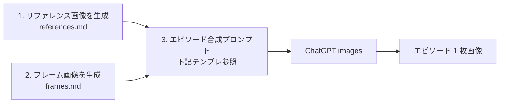

# 画像生成プロンプト集 (Image Prompts)

> ChatGPT images (gpt-image) で漫画 1 枚を生成するときの **入力素材** を作るためのプロンプト集。
> 想定モデル: ChatGPT 上の画像生成 (images 2.0 / gpt-image-1)。

## ファイル構成

| ファイル                       | 内容                                                |
| ------------------------------ | --------------------------------------------------- |
| [`README.md`](./README.md)     | 全体の運用フロー + ベーススタイル（共通プリアンブル）|
| [`references.md`](./references.md) | キャラ立ち絵 / ラボ内装 / 小道具のリファレンス画像生成プロンプト |
| [`frames.md`](./frames.md)     | コマ割りフレーム（空白パネルテンプレ）の生成プロンプト |

## 全体ワークフロー



1. **リファレンス画像** をすべて生成して `assets/characters/` `assets/concept/` に保存（**初回 1 回**）
2. **フレーム画像** を必要なコマ数ぶん生成して `assets/concept/frames/` に保存（**初回 1 回**）
3. **エピソードごと** に、リファレンス + フレームを **入力画像として添付** し、シナリオを合成プロンプトで指示

> `assets/concept/` の中に `frames/` `style-guide/` などのサブディレクトリを切ると整理しやすい。

---

## ベーススタイル（共通プリアンブル）

**すべての画像生成プロンプトの先頭に貼り付ける** 共通スタイル指示。
リファレンス画像 / フレーム / 本番エピソード、どれを生成するときも先頭に置く。

```
[シリーズ共通スタイル]
- シリーズ名: シュンタのクリエイティブラボ日記
- ジャンル: 日常コメディ・1 枚完結のショート漫画
- 全体の雰囲気: モダン / ミニマル / 親しみやすい丸み / 日本の Web 漫画調

[配色]
- ベース 70%: メインブラック #0F0F10 / ダークグレー #2A2A2E
- ホワイト 20%: #FFFFFF (ハイライト・テキスト)
- ネオンピンク 10%: #FF2D7A (アクセント・タイトル・主要装飾)
- シアンブルー 補助: #6EE7F7 (デジタル感・控えめに)
- 高彩度のオレンジ・緑・黄色は使わない

[線・形]
- キャラ輪郭: 太いアウトライン (4〜6px 相当)
- 内側ディテール: 中 (2〜3px 相当)
- 装飾線: 細 (1〜2px 相当)
- パネル枠: 大きめの角丸 (16〜24px 相当)
- 吹き出し: ぷっくりした角丸

[NG]
- 写真調 / 3D レンダリング調 / 水彩調
- 過剰なグラデーション
- リアルな人物写真の質感
- 細かいクロスハッチング
- ベンダー名 / モデル名 / ロゴ / 既存企業の文字描画
```

---

## エピソード合成プロンプトのテンプレ

各エピソード生成時に組み立てるプロンプト。
**[ベーススタイル]** をそのまま貼り、**[入力画像]** に参照する画像を列挙し、**[シナリオ]** に各コマの内容を書く。

```
[ベーススタイル]
（README.md の「ベーススタイル」をここに貼り付け）

[入力画像]
- frame: 4-koma-portrait.png  (空白フレーム)
- char: shunta-ref.png        (キャラリファレンス)
- char: monaka-ref.png
- (登場キャラぶん列挙)
- env: lab-interior-ref.png   (ラボ内装)
- style: style-guide.png      (色・線・吹き出しのリファレンス)

[出力フォーマット]
- 出力サイズ: 1024 x 1536 (portrait 2:3)
- 上記 frame の構造に合わせてコマを描画
- 1 枚画像で完結

[シナリオ]
タイトル: <エピソードタイトル>
ログライン: <1 行>

# コマ 1
- 場面: ...
- ゾーン: 執務エリア / 中央 / 和み / 玄関 / 窓側 / 屋外 のいずれか
- 時刻: 朝 / 昼 / 夕方 / 夜
- 登場: シュンタ, モナカ
- 動作・表情: ...
- 話者: シュンタ
- 吹き出し: ここに本文のみ
- キャラ名タグ: シュンタ（左下、ピンク + 白）
- 効果音 / モノローグ: なし

# コマ 2
（同形式で繰り返し）

[吹き出しのルール]
- 各セリフの吹き出しは話者の口元の近くに配置する
- テイル (尾の三角) は話者の方向を指す
- 吹き出しの中には「セリフ本文だけ」を入れる。話者名は書かない
- 各パネル左下にキャラ名タグ（ピンク背景 #FF2D7A + 白文字）を表示
- 1 パネルに複数話者がいる場合はタグを左下にまとめて並べる

[整合性]
- キャラの服装・配色・小道具は char リファレンス画像に厳密に従う
- ラボ内装は env リファレンス画像のレイアウトを尊重する
```

> 詳細な吹き出しルールは [`../../design-system/speech-bubbles.md`](../../design-system/speech-bubbles.md) も参照。

---

## 注意

- **アイリス** は特定の AI ベンダー / モデル名を連想させる造形にしない（抽象シルエット）
- **バグまる** にセリフを描かせない（効果音「ぴょこ」「ぴゃっ」のみ）
- **モナカ** に人語を喋らせない（鳴き声「わふっ」「くぅーん」のみ）
- 既存企業 / プロダクトのロゴ・名前を画面に出さない

## 関連ドキュメント

- カラーパレット: [`../../design-system/color-palette.md`](../../design-system/color-palette.md)
- シェイプ・ライン: [`../../design-system/shapes-and-lines.md`](../../design-system/shapes-and-lines.md)
- モチーフ: [`../../design-system/motifs.md`](../../design-system/motifs.md)
- 吹き出しルール: [`../../design-system/speech-bubbles.md`](../../design-system/speech-bubbles.md)
- リズム設計: [`../../design-system/rhythm.md`](../../design-system/rhythm.md)
- ワークフロー: [`../workflow.md`](../workflow.md)
