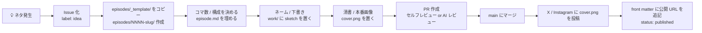

# 制作ワークフロー

「ネタを思いつく」から「投稿する」まで、このリポジトリ上でどう運用するか。

## 基本方針

- **毎日連載はしない**。出せるときに出す
- **1 話 = 画像 1 枚**。コマ数はネタごとに最適化
- 整合性のチェックや壁打ち相手として Claude Code を常駐させる
- リリース単位は **1 話 = 1 リリース**。記事 / シリーズ束のような上位単位は持たない

## 1 話のフォーマット

- **画像 1 枚**（X / Instagram 投稿用）
- コマ数自由（1 コマ〜可変）
- 1 枚の中で必ず 1 回オチる

詳しいリズム設計は [`../design-system/rhythm.md`](../design-system/rhythm.md) を参照。

## 1 話 = 1 フォルダ

```
episodes/
└── NNNN-slug/
    ├── episode.md          ← 脚本・コマ割り・メモ・front matter
    ├── cover.png           ← 完成版 1 枚画像（SNS 投稿用）
    └── work/               ← ネーム / 下書き（任意・公開しなくてよい）
        └── sketch-*.png
```

完成画像のファイル名は **必ず `cover.png`** に統一する。

## ネタ → 公開までのフロー



## 1. ネタを思いつく

- すぐメモ → Issue を立てる（`idea` ラベル）
- Issue 内に **想定 arc** を書く（`standalone` / `main` / `bugmaru` / `seasonal` / `side`）
- ざっくりは `ideas/backlog.md` に 1 行追記でも OK

## 2. エピソード起こし

```bash
cp -r episodes/_template episodes/0001-your-slug
```

front matter を埋める:

```yaml
id: 0001
title: "..."
status: draft
season: S1
arc: standalone
characters: [shunta]
panels: 4              # 想定コマ数（後で変えて OK）
created: YYYY-MM-DD
```

## 3. 構成を書く

- `episode.md` の **「構成設計」** で コマ数 / 配置 / 緩急の山 / オチの位置 を決める
- **「コマ割り」** に各コマの画 / セリフを書く
- ネタに応じてコマ数は自由。1 枚絵なら「コマ 1 のみ」でも OK
- 1 枚の中で必ず 1 回オチているか、書き終えた段階で確認

## 4. ネーム・下書き

- `work/` 配下に `sketch-1.png` などを置く
- ラフの段階で読み流れ / 視線誘導が破綻していないか確認
- `work/` は公開不要なら `.gitignore` でも OK（運用は緩く）

## 5. 清書 → 完成画像

- 完成版を **`cover.png`** として `episodes/NNNN-slug/` 直下に置く
- 解像度・縦横比は SNS 投稿前提で決める（縦長推奨）
- ChatGPT images で生成する場合は [`./image-prompts/`](./image-prompts/) のプロンプト集を使う
  - リファレンス画像（キャラ立ち絵 / ラボ内装）は **初回のみ** 生成して `assets/` に保存
  - フレーム画像（コマ割りテンプレ）も **初回のみ** 生成して `assets/concept/frames/` に保存
  - 各エピソードは「リファレンス + フレーム + シナリオ」の合成プロンプトで生成

## 6. レビュー

- 自分一人なら **PR を立ててセルフレビュー**
- Claude Code に PR レビューを依頼して整合性チェック
  - 過去話との矛盾がないか
  - キャラの口調がブレていないか
  - 大外プロット ([`../lore/storyline/`](../lore/storyline/)) との整合
  - リズム設計 ([`../design-system/rhythm.md`](../design-system/rhythm.md)) のチェックリストを通せるか
- 「ここのセリフ言わせ過ぎ」「中盤に山を作ろう」のような赤入れも、過去の改善履歴として残しておく

## 7. 公開

- 投稿後、`status: published` に更新し、`post_urls` に SNS リンクを記入
- main にマージしたタイミングで完了

## ブランチ運用

- `main`: 公開済 + 公式設定
- `claude/episode-NNNN-slug`: エピソード制作用
- `claude/character-<name>`: キャラ設定変更用
- `claude/design-<topic>`: デザインシステム更新用
- `claude/lore-<topic>`: 世界観・ストーリー設定の更新用

## ラベル設計（推奨）

| ラベル              | 用途                                     |
| ------------------- | ---------------------------------------- |
| `idea`              | バックログにある段階のネタ               |
| `episode`           | エピソード化された案件                    |
| `character-update`  | キャラ設定の追加・変更                    |
| `lore-update`       | 世界観・ストーリーの更新                  |
| `design`            | デザインシステム関連                      |
| `published`         | 公開済                                    |
| `retro`             | 振り返り・リサイクルしたいネタ            |

## 補足: AI 相棒（Claude Code）の役割

このワークフローでは Claude Code を **「世界法則の番人」** 兼編集者として
常駐させる前提でいる。任せたい役割はざっくり以下:

- 整合性のガード（過去話との矛盾検出）
- 壁打ち相手（展開・キャラ性格の妥当性チェック）
- 設定・世界観の保持
- 過去話との照合と補正提案
- リズム設計チェックリストの自動レビュー
